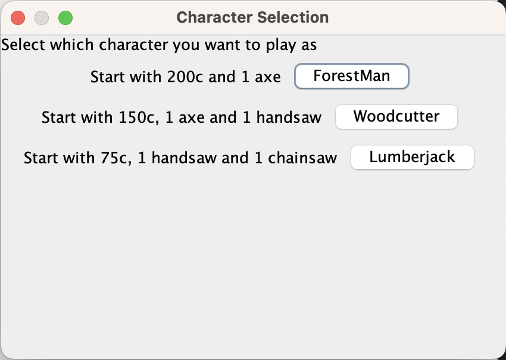
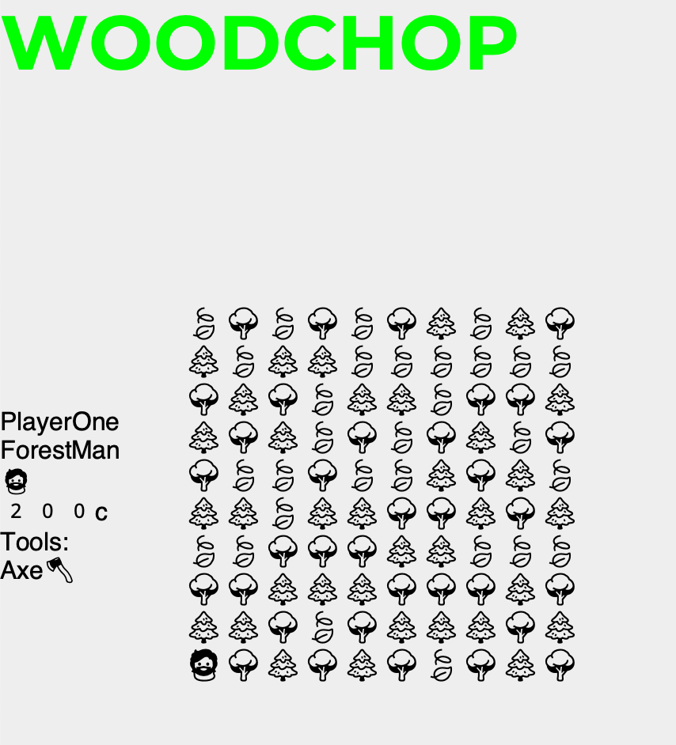

# Woodchop

*Java mini text-based RPG*

## Conception & documentation

Le fichier `CONCEPTION.md` fait parti des outils, en dehors de l'UML, 
que j'ai utilisés pour concevoir l'aspect technique de ce jeu.


## Principe du jeu



Choisissez un personnage parmis les 3, et avec vos outils,  
couper les arbres sur votre chemin afin d'arriver à destination,  
c'est à dire en haut à droite de la map.



Lorsque vous vous déplacer sur une cellule de la map contenant  
un arbre ou un buisson, vous le coupez automatiquement.

La vitesse à laquelle les outils coupent le bois est proportionnelle  
à leur prix.  
Plus le prix est élevé, plus l'outil coupe le bois rapidement.
À chaque arbre / buisson coupé, vous récupérez sa valeur en crédits.


Le magasin (store) permet d'échanger ses outils contre de l'argent,  
ou d'acheter des outils.

## Commandes

Les touches permettant de se déplacer et d'accéder au magasin,  
ainsi qu'au autres options du jeu, sont indiquées à chaque fois.
Pas besoin donc de les retenir.

## Installation

Il y a seulement besoin de télécharger le fichier `woodchop.jar`

## Utilisation

Ce jeu est fait pour être joué depuis le terminal, donc depuis la ligne de commande, 
naviguez jusqu'au dossier où se trouve le fichier jar, et écrivez:

```
java -jar woodchop.jar
```


